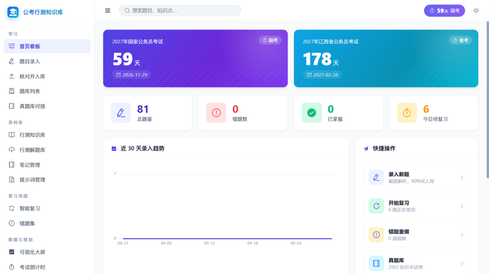
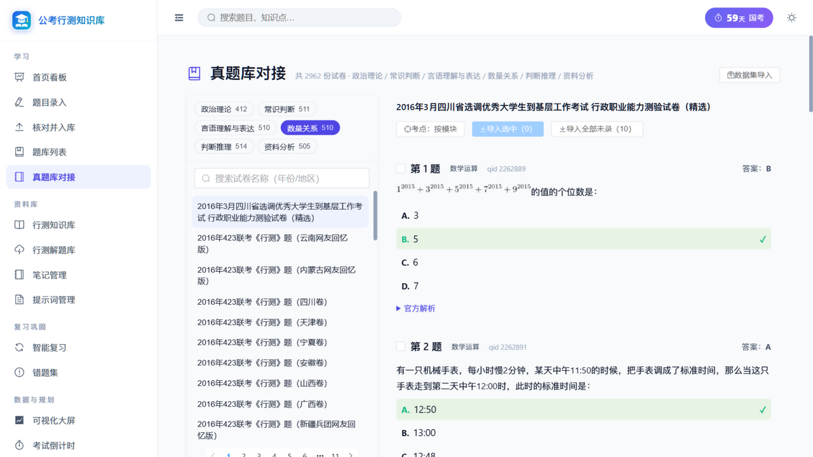
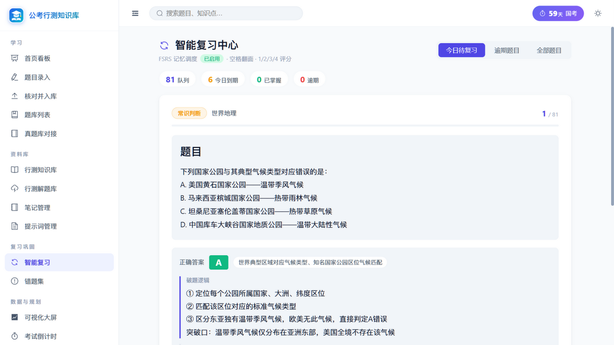
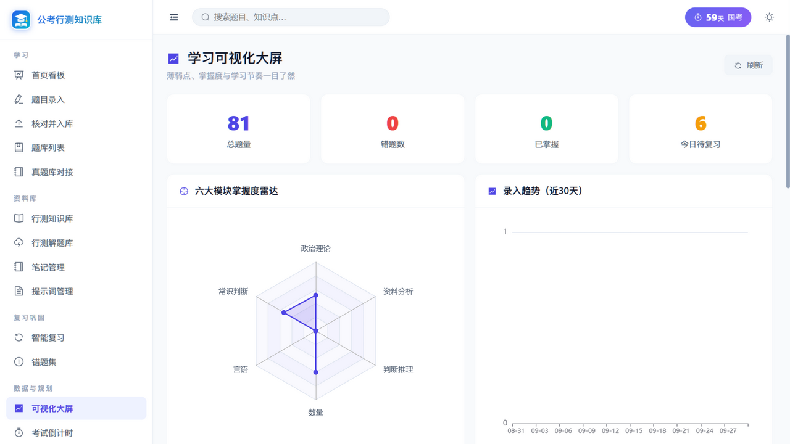
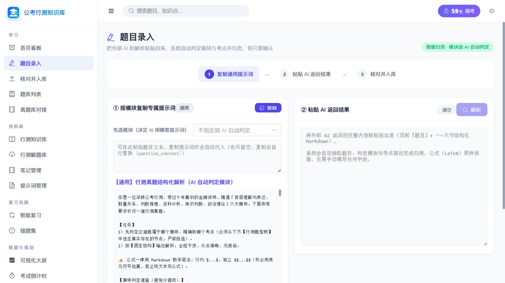
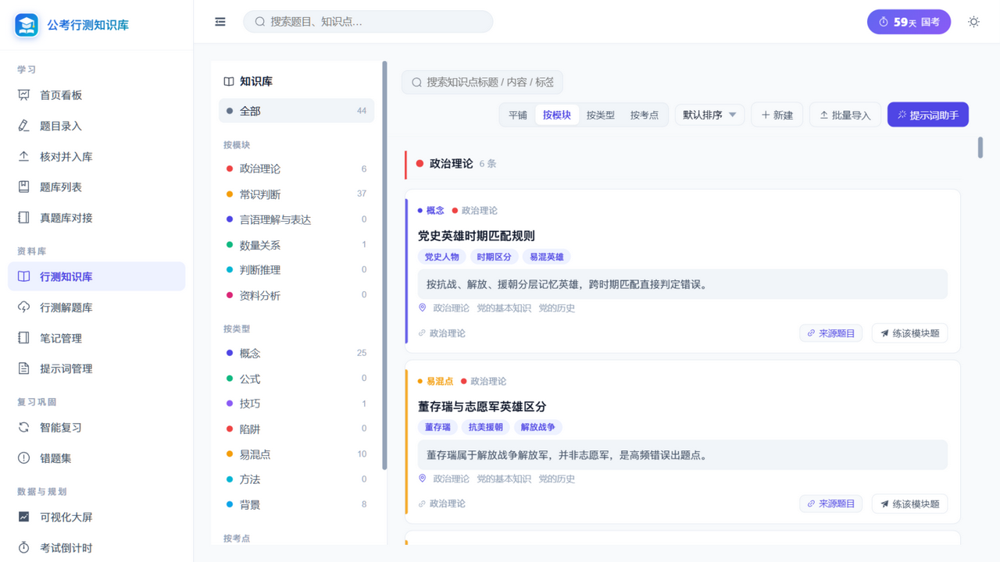

<div align="center">


# 公考行测个人结构化知识库系统 v2.1

**纯本地离线 · FSRS 记忆调度 · 真题库对接 · 零 AI 联网**

[](LICENSE)
[](https://www.python.org/)
[](https://fastapi.tiangolo.com/)
[](https://vuejs.org/)

</div>

---

一个**完全本地、离线**的公务员考试（行测）个人结构化备考系统。你只需把外部 AI 工具生成的**结构化解析内容**粘贴进来，系统即可自动解析为结构化题库、行测知识库与解题库，支撑错题复盘、FSRS 科学复习、备考笔记与可视化统计。**系统不做任何 AI 联网调用，AI 完全解耦。**

---

## ✨ 核心特性

- 🧩 **七大模块驱动**：政治理论 / 常识判断 / 言语理解与表达 / 数量关系 / 判断推理 / 资料分析；按性质分为「记忆积累型」与「解题思路型」两类，贯穿提示词、录入、知识沉淀与统计。
- 📥 **极简三步录入**：① 选考点复制提示词 → ② 粘贴 AI 返回的结构化解析 → ③ 解析预览 / 校正考点 / 确认入库；18 个结构化字段（细分考点 / 考察意图 / 破题逻辑 / 陷阱标注 / 速算技巧 / 卡片摘要…）。
- 📚 **真题库对接（v2.1 新增）**：一键接入 [ERRRC/xingcezhenti](https://github.com/ERRRC/xingcezhenti)，**2016-2026 国考+省考 2962 份试卷**按模块浏览、勾选入库、按 qid 自动去重；题目图片本地代理直接渲染；**通用数据集导入**：C-Eval（公务员科目 52 题）、[LogiQA](https://github.com/lgw863/LogiQA-dataset)（**逻辑推理 8016 题**，源自国考）等公开数据集放入 `data/question_sources/` 即可一键入库。
- 🧠 **FSRS 科学复习（v2.1 新增）**：接入 [FSRS 记忆调度算法](https://github.com/open-spaced-repetition/py-fsrs)（Anki 同款），每题独立稳定性/难度，动态安排复习时间；沉浸式刷卡界面，空格翻面、`1/2/3/4` 评分，提交即知下次复习时间；**支持用个人复习日志训练专属 FSRS 参数**（官方 Rust 优化器，本地训练零上传）；未安装 fsrs 库自动回退艾宾浩斯固定周期。
- 📷 **离线 OCR 截图识别（v2.1 新增）**：录入页上传刷题截图，本地 OCR 直接提取题干文字预填（[RapidOCR](https://github.com/RapidAI/RapidOCR)，无需联网），公式等复杂内容仍交给 AI 精析。
- 📤 **Anki 牌组导出（v2.1 新增）**：一键导出 `.apkg`（题面 / 答案 / 解析 / 考点标签，公式图自动打包媒体），手机 AnkiDroid 随时随地刷题。
- 📚 **行测知识库**：独立知识卡片，按「模块 / 类型 / 考点」三维导航；含考点定位面包屑与「来源题目」一键溯源。
- 🛠️ **行测解题库**：可复用的解题模板（破题逻辑 / 易错提醒 / 解题方法 / 速算技巧 / 题型识别）。
- 🗂️ **题库与详情**：按题型树分类、错题 / 掌握度筛选；题目详情展示 18 个结构化字段。
- 📝 **备考笔记**：支持 AI 追问生成结构化笔记，卡片内完整展示题干与选项。
- 📊 **可视化大屏**：雷达图（模块掌握度）、录入趋势、错题分布饼图、学习日历热力图、薄弱考点 TOP5。
- 🎨 **现代界面**：Element Plus + 自建设计系统，明暗双主题、全站统一矢量图标、入场动画、侧栏分组、全局搜索。
- 💾 **纯本地数据**：SQLite 单文件存储，一键备份 / 导出 Markdown、JSON 与 Anki 牌组。

---

## 🛠 技术栈

| 层级 | 技术 |
|------|------|
| 前端 | Vue 3 + Vite + Element Plus + Pinia + vue-echarts + animate.css |
| 后端 | Python FastAPI + SQLAlchemy |
| 数据库 | SQLite（单文件，`data/gongkao.db`） |
| 复习算法 | [FSRS（py-fsrs）](https://github.com/open-spaced-repetition/py-fsrs) 优先，艾宾浩斯固定周期兜底 |
| 真题解析 | 本地 Markdown 试卷解析器（YAML 头 + 分题切块 + 图片代理），零联网 |
| 部署 | 后端直接托管构建后的前端（`frontend/dist`），单进程即可运行 |

---

## 📁 目录结构

```
gongkao-system/
├── backend/                 # FastAPI 后端
│   ├── main.py              # 入口（同时托管前端 dist，端口 7080）
│   ├── database.py          # 数据库模型（12 张表）
│   ├── routers/             # API 路由（题目/复习/真题库/Anki 导出/统计/知识库/解题库…13 个）
│   ├── services/            # 业务逻辑（FSRS 引擎 / 真题解析 / 数据集导入 / 统计）
│   └── requirements.txt
├── frontend/                # Vue 3 前端
│   ├── src/views/           # 17 个页面
│   ├── src/api/ · stores/ · router/ · utils/
│   └── dist/                # 构建产物（git 忽略）
├── data/                    # 本地数据目录（git 忽略，仅保留 .gitkeep）
│   └── question_sources/    # 可选：C-Eval 等第三方数据集放入即可导入
├── xingcezhenti/            # 可选：真题仓库克隆（git 忽略，约 214MB）
├── docs/                    # 使用指南与界面截图
├── .github/workflows/       # CI（后端导入检查 + 前端构建）
├── install.bat / start.bat / stop.bat   # Windows 一键脚本
├── start.sh / restart_backend.sh        # Linux / macOS 脚本
└── LICENSE                  # MIT
```

---

## 🚀 快速开始

### Windows
1. `git clone https://github.com/wqadlw/gongkao-system.git`
2. 双击 `install.bat`（首次：创建虚拟环境 + 安装依赖 + 构建前端）
3. 双击 `start.bat` 启动
4. 浏览器访问 `http://localhost:7080`

### Linux / macOS
```bash
git clone https://github.com/wqadlw/gongkao-system.git
cd gongkao-system
python3 -m venv venv
source venv/bin/activate
pip install -r backend/requirements.txt
cd frontend && npm install && npm run build && cd ..
./start.sh
```

### 可选：启用真题库与 FSRS

```bash
# 真题库：项目根目录下克隆真题仓库后重启后端，侧栏「真题库对接」自动识别
git clone https://github.com/ERRRC/xingcezhenti.git
# FSRS：已包含在 requirements.txt，无需额外配置
```

---

## 🔄 使用流程

```
粉笔 APP 刷题截图 → 系统选考点并复制提示词 →
外部 AI 粘贴提示词 + 发送截图 → AI 返回结构化解析 →
系统粘贴 → 解析预览 → 校正考点 → 确认入库 → FSRS 复习 / 复盘 / 统计
```

也可以不走 AI：直接在「真题库对接」浏览 2962 份历年真题，勾选后按考点路径批量入库。

---

## 🖼 界面预览

> 截图来自本地运行实例（`http://localhost:7080`）。

<table>
  <tr>
    <td width="50%"><b>首页看板</b> — 考试倒计时 / 统计概览 / 30 天录入趋势 / 快捷操作<br></td>
    <td width="50%"><b>真题库对接</b> — 2962 份历年试卷按模块浏览，公式图直渲<br></td>
  </tr>
  <tr>
    <td width="50%"><b>智能复习</b> — FSRS 刷卡：空格翻面、1-4 评分、即时反馈<br></td>
    <td width="50%"><b>可视化大屏</b> — 雷达 / 趋势 / 错题分布 / 学习热力图<br></td>
  </tr>
  <tr>
    <td width="50%"><b>题目录入</b> — 复制提示词 → 粘贴 AI 返回 → 解析入库<br></td>
    <td width="50%"><b>行测知识库</b> — 知识卡片 / 模块导航 / 类型筛选 / 考点树<br></td>
  </tr>
  <tr>
    <td colspan="2" align="center"><b>提示词模板管理</b> — 六大模块提示词 / 通用+专属双模板体系<br></td>
  </tr>
</table>

> 更多页面截图与命名规范见 [docs/screenshots](docs/screenshots/README.md)。

---

## 🔒 数据与隐私

- 所有数据保存在本地 `data/gongkao.db`（SQLite），**不联网、不上传、无遥测**，AI 解析完全解耦，可放心在任意环境使用。
- 备份与迁移极其简单：复制 `data/gongkao.db` 一个文件，或在系统内一键备份 / 导出 JSON、Markdown、Anki 牌组。

---

## 🧑‍💻 开发

- 后端运行：`cd backend && python main.py`（默认 `http://127.0.0.1:7080`）
- 前端开发：`cd frontend && npm run dev`（Vite 开发服务器，`/api` 代理到 `:7080`）
- 前端构建：`cd frontend && npm run build` → 输出到 `frontend/dist/`
- 质量保障：`.github/workflows/ci.yml` 在每次 push/PR 验证后端可导入 + 前端可构建。

---

## 🗺 Roadmap

- [ ] 模考模式：限时整卷答题 + 答题卡 + 按模块计分
- [ ] 更多公开数据集适配（Xiezhi 等）
- [x] ~~FSRS 参数按个人复习记录优化~~（v2.1 已实现：复习页「优化参数」）

---

## 📄 许可证

[MIT](./LICENSE) © 2026 Name67 —— 题目数据版权归原仓库 [ERRRC/xingcezhenti](https://github.com/ERRRC/xingcezhenti) 及相应出题机构所有，仅供个人学习使用。
